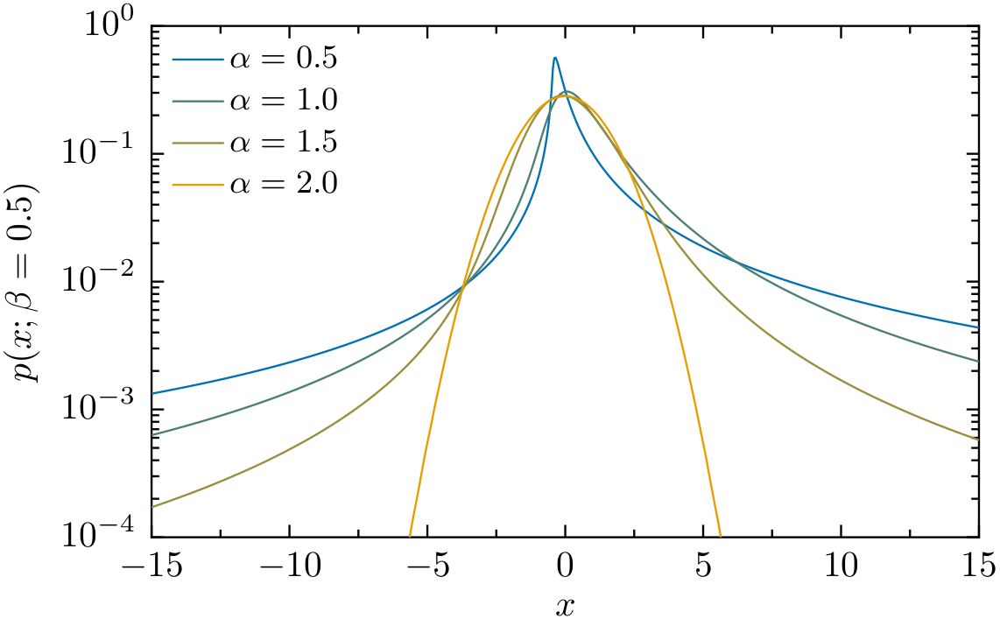

.. pylevy documentation master file, created by
   sphinx-quickstart on Fri Aug 17 21:58:25 2018.
   You can adapt this file completely to your liking, but it should at least
   contain the root `toctree` directive.

Welcome to pylevy's documentation!
==================================

.. toctree::
   :maxdepth: 2
   :caption: Contents:

   levy

Indices and tables
==================

* :ref:`genindex`
* :ref:`modindex`
* :ref:`search`
