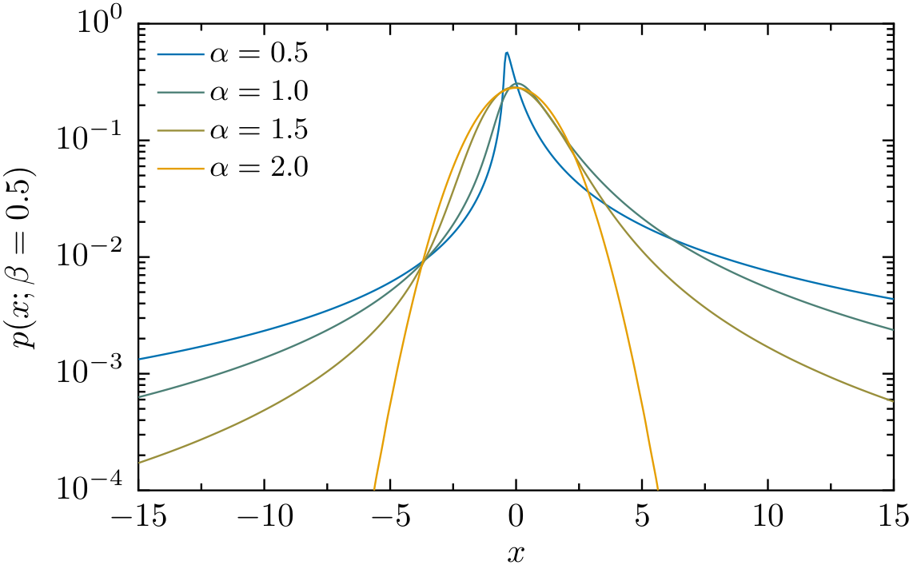

pylevy
======

Levy alpha-stable distributions for Python: density, distribution function,
sampling, and maximum-likelihood fitting.

Direct computation of a stable density requires a lengthy numerical
integration. pylevy interpolates a precomputed table instead, which is what
makes fitting by maximum likelihood fast enough to be practical.
:doc:`how_it_works` explains how, and where the accuracy comes from.

Install
-------

.. note::

   The ``pylevy`` name on PyPI still belongs to the 2005 package this one
   descends from, so ``pip install pylevy`` does **not** install this yet.
   Until the name is settled, install from the repository:

.. code-block:: console

   pip install git+https://github.com/josemiotto/pylevy

Optional extras: ``pylevy[pandas]`` for labeled input and output,
``pylevy[torch]`` for a differentiable backend. Neither is imported unless it
is installed and used.

.. code-block:: console

   pip install "pylevy[pandas] @ git+https://github.com/josemiotto/pylevy"

Coming from 1.x? Every 1.x name still works and, away from the bugs 2.0
fixes, returns the same numbers. :doc:`migration` lists each old name and its
replacement.

At a glance
-----------

.. testcode::

   import numpy as np
   from levy import api

   x = np.array([-1.0, 0.0, 1.0])

   api.pdf(x, alpha=1.5, beta=0.0)
   api.cdf(x, alpha=1.5, beta=0.0)

   sample = api.rvs(alpha=1.5, beta=0.0, size=1000, random_state=0)
   result = api.fit(sample)
   result.params

Parameters are validated where you write them, so ``alpha=0.2`` raises rather
than quietly returning a wrong number from a clamped table index.

.. toctree::
   :maxdepth: 2
   :caption: Contents

   how_it_works
   api
   migration
   changelog

Indices and tables
==================

* :ref:`genindex`
* :ref:`modindex`
* :ref:`search`
